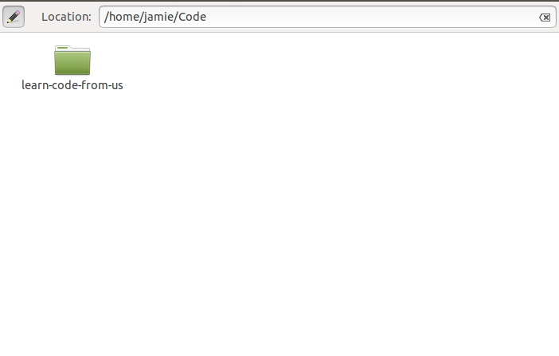
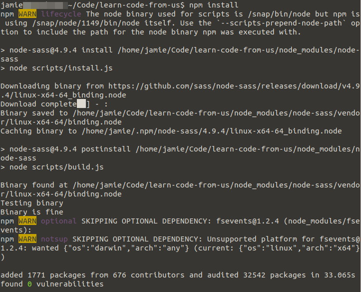

# Learn Code from Us

## Project Introduction

The following text was taken from the about page on [https://learncodefrom.us](https://learncodefrom.us):

> Learn Code from Us is a site that lists people who are members of underrepresented groups in tech who create resources geared towards programmers of all levels. These resources include (but are not limited to) podcasts, blog posts, newsletters, or YouTube videos. For now, this site is geared towards free resources in order to be as accessible as possible

## The Detailed Readme

If you would like a less detailed list of instructions for building this repo, please see the [Readme](Readme.md)

## Software Requirements

You will need the following software to be installed in order to build the code within this repository:

### A Git Client

This is required so that you can "clone" the this repository to your computer. "Cloning" code can be thought of as copying it.

Most operating systems have a git client included. However, these are command line based and can be a little obtuse to start with.

Some graphical git applications include:

- [The GitHub application](https://desktop.github.com/)
- [SourceTree](https://www.sourcetreeapp.com/)
- [Gitkraken](https://www.gitkraken.com/)

### A Text Editor

You could use a full IDE (Integrated Development Environment), but a text editor will do just as well. Some recommended text editors include:

- [Sublime Text](https://www.sublimetext.com/)
- [Atom](https://atom.io/)
- [Visual Studio Code](https://code.visualstudio.com/)
- [WebStorm](https://www.jetbrains.com/webstorm/)
- Notepad

### Node and the npm package manager

[Node](https://nodejs.org/en/) is a technology which allows you to run JavaScript (traditionally a language which used to only run in web browsers) on your desktop.

It includes npm (or Node Package Manager). This is a huge repository of open source JavaScript code libraries that you can add to your application.


## Set up instructions

### Cloning the Repository to Your Computer

Precisely how you will do this depends on your git client.

If you are using the official GitHub client for example, then you should be able to follow [these instructions](https://help.github.com/desktop/guides/contributing-to-projects/cloning-a-repository-from-github-to-github-desktop/) to clone the repository.

If you are using a command line based git client, then the following command will clone the repository to your computer:

``` bash
git clone https://github.com/aspittel/learn-code-from-us.git
```

The above command will copy all of the files, and their history, to your computer.

### Installing all of the Node Packages

Once you have cloned the repository to your computer, you need to install all of the Node Packages. To do this, you will need to open a command line window (sometimes called a "terminal") and point it at the directory with the cloned respository in it.

For example, if your closed repository is in the following directory:



Then you would need to open a command line and issue the following command:

``` bash
cd /home/jamie/code/learn-code-from-us
```

This tells the command line interpreter (which is what the command line passes your input to), to change directory (which is what the `cd` part means) to `/home/jamie/code/learn-code-from-us`

This is like opening your file explorer (`My Computer` on Windows, `Finder` on MacOS) in that directory.

Once we're there, running the following command will restore all of the Node packages:

``` bash
npm install
```

You could shorten this to `npm i` if you like.

This will cause Node to read the contents of the `package.json` file and download all of the Node packages that this repository needs in order to run. An example of what might be displayed as output from this command is:



### Running the Code

Once you have installed all of the Node packages, you can run the code by issuing the following command:

``` bash
npm start
```

This will tell Node to start a webserver and host all of the files that it sees in the `learn-code-from-us` directory. It will also start a new tab in your web browser and point it at the running code.
